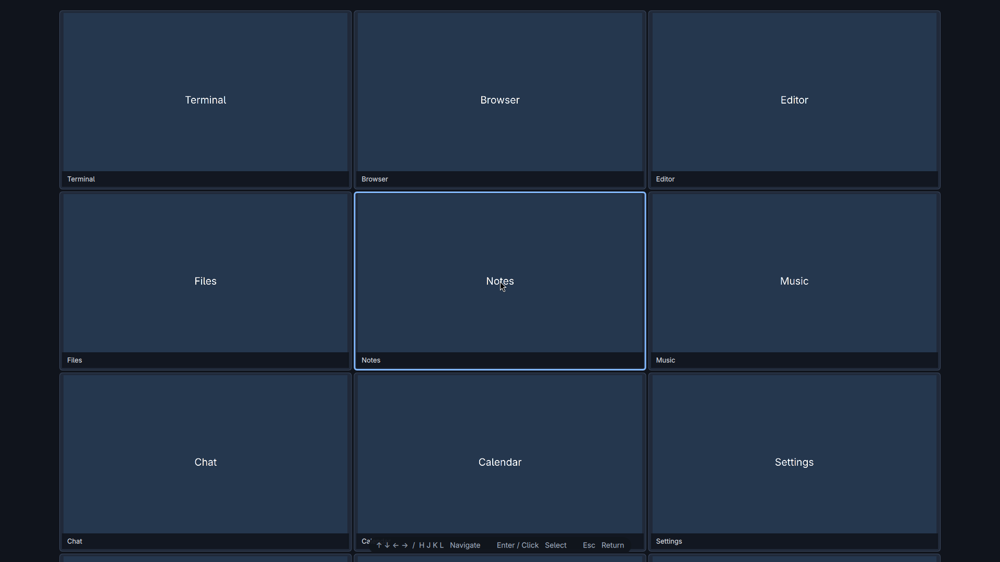

# Hyprscroll2D

[](https://github.com/kirollosatef/hyprscroll2d/actions/workflows/tests.yml)
[](LICENSE)

Hyprscroll2D is an experimental two-dimensional scrolling layout for Hyprland.
It turns a workspace into an expandable grid and lets you move through it in
every direction.

Unlike column-only scrolling layouts, windows can live above, below, left and
right of each other. Configurable edge peeks keep nearby rows and columns
visible, so you never lose the shape of your workspace.

## What works

- Infinite two-dimensional window placement
- Focus and camera movement on both axes
- Directional window movement with collision swapping
- Independent width and height presets
- Visible edge peeks for neighboring rows and columns
- Per-workspace in-memory layout state
- Omarchy bindings that fall back to the normal action outside Hyprscroll2D

## Status

`v0.2.0` is an experimental preview for Hyprland `0.56.x`. It has been
live-tested on Hyprland `0.56.2` and is intentionally enabled on only one
workspace during evaluation.

The layout uses Hyprland's Lua custom-layout API, so it does not require a
compiled Hyprland plugin. Native Omarchy Shell packaging loads the layout and
keeps it active across Hyprland config reloads. Other Lua-configured Hyprland
installations can load the layout, but must provide their own bindings.

## Install on Omarchy

### Recommended: Omarchy plugin command

Requirements:

- Current Omarchy Quattro with Hyprland `0.56.x`

Install and enable directly from GitHub:

```bash
omarchy plugin add https://github.com/kirollosatef/hyprscroll2d --enable
```

The plugin loads Hyprscroll2D at runtime without editing your Hyprland config.
It enables the layout on workspace 9 by default. Press `Super+9`, open a few windows,
and try the controls below.

Update it later with:

```bash
omarchy plugin update io.github.kirollosatef.hyprscroll2d
```

The repository contains a validated Omarchy `manifest.json` and can be
installed through the official `omarchy plugin` command today. A listing on
the community [Omarchy Plugin Marketplace](https://omarchyplugins.com/) is a
separate review process and does not make a plugin part of Omarchy's bundled
first-party plugins.

### Alternative: config installer

If your Omarchy version does not yet provide `omarchy plugin`, clone the
project and run the config installer:

Clone the project and run the installer:

```bash
git clone https://github.com/kirollosatef/hyprscroll2d.git \
  ~/.local/share/hyprscroll2d
~/.local/share/hyprscroll2d/install.sh
```

This alternative installer:

- creates a timestamped backup of `~/.config/hypr/hyprland.lua`;
- enables Hyprscroll2D only on workspace 9;
- reloads Hyprland and checks for configuration errors;
- restores the backup automatically if the new block causes an error.

To use a different experimental workspace, pass its number:

```bash
~/.local/share/hyprscroll2d/install.sh 8
```

For a manual installation, add the following near the end of
`~/.config/hypr/hyprland.lua`, after the Omarchy defaults and your normal
`require("hypr.*")` lines:

```lua
local hyprscroll2d = os.getenv("HOME") .. "/.local/share/hyprscroll2d"
dofile(hyprscroll2d .. "/layout/init.lua")({
  peek_x = 48,
  peek_y = 48,
  gap_x = 12,
  gap_y = 12,
  width_steps = { 0.50, 0.67, 0.85, 1.00 },
  height_steps = { 0.50, 0.67, 0.85, 1.00 },
  default_width_step = 2,
  default_height_step = 3,
})
dofile(hyprscroll2d .. "/integration/omarchy.lua")

-- Start safely on one experimental workspace.
hl.workspace_rule({ workspace = "9", layout = "lua:hyprscroll2d" })
```

Then reload and validate the configuration:

```bash
hyprctl reload
hyprctl configerrors
```

If `hyprctl configerrors` prints nothing, the manual setup is ready.

## Controls

| Action | Binding |
| --- | --- |
| Focus a window | `Super+Arrow` |
| Move or swap a window | `Super+Shift+Arrow` |
| Pan the camera | `Super+Ctrl+Arrow` |
| Grow window width | `Super+-` |
| Shrink window width | `Super+=` |
| Grow window height | `Super+Shift+=` |
| Shrink window height | `Super+Shift+-` |
| Open overview, with the Omarchy shell plugin | `Super+Ctrl+Shift+O` |

These keys retain Omarchy's normal behavior whenever the active window is not
using Hyprscroll2D.

## Find a window in overview



On the configured canvas workspace, press `Super+Ctrl+Shift+O` to zoom out.
Overview fills the current monitor and shows roughly three rows and three columns
in their existing positions over the current desktop wallpaper. Wallpaper changes
follow the Omarchy background service automatically. Empty cells stay empty. Arrow keys or `H/J/K/L`
select a window and pan the overview when the selection reaches its edge.

- Press Enter or click a preview to focus that window at normal zoom.
- Press Escape to restore the original window and camera, including a manually panned view.
- Application keystrokes and clicks are captured while overview is open. Desktop
  shortcuts marked `locked`, such as volume controls, remain compositor shortcuts.

Previews are still captures, refreshed when a preview enters the view. This keeps
the window finder from continuously streaming nine applications. Overview requires
the Omarchy shell installation and Quickshell's `ScreencopyView` support. The
standalone Lua installation does not provide the overlay.

Hyprland 0.56 cannot capture a window that is completely outside its monitor.
While overview is covered by an opaque layer, the layout temporarily centers
windows behind it without resizing them. Their saved grid positions stay intact.
Placements are restored before the overlay disappears. A three-second watchdog
also restores the canvas if the shell stops responding.

If the selected window closes during confirmation, overview cancels the selection.
If the original window closes, Escape restores the original camera and a surviving
window. Closing every window dismisses overview.

After upgrading from an earlier plugin version, run `hyprctl reload` once to load
the new Lua interface. To open overview through IPC:

```bash
omarchy-shell io.github.kirollosatef.hyprscroll2d open
```

## Customize the layout

Add settings directly to the plugin entry in `~/.config/omarchy/shell.json`:

```json
{
  "id": "io.github.kirollosatef.hyprscroll2d",
  "workspace": 9,
  "overviewKeybind": "SUPER + CTRL + SHIFT + O",
  "peekX": 48,
  "peekY": 48,
  "gapX": 12,
  "gapY": 12,
  "focusFollowsMouse": true,
  "widthSteps": [0.50, 0.67, 0.85, 1.00],
  "heightSteps": [0.50, 0.67, 0.85, 1.00],
  "defaultWidthStep": 2,
  "defaultHeightStep": 3
}
```

- `workspace`: workspace that uses Hyprscroll2D
- `overviewKeybind`: overview activation shortcut in Hyprland Lua key syntax; choose an unused shortcut
- `peekX` and `peekY`: visible pixels from neighboring columns and rows
- `gapX` and `gapY`: spacing between cells
- `focusFollowsMouse`: whether moving the pointer focuses the window beneath it
- `widthSteps` and `heightSteps`: available size presets from greater than zero through one
- `defaultWidthStep` and `defaultHeightStep`: one-based initial size preset indexes

Omitted fields use the defaults shown above. Supply a valid, unused key combination
for `overviewKeybind`. Layout settings apply
automatically; changing `workspace` reloads Hyprland before applying the new rule.

## Update a config installation

```bash
git -C ~/.local/share/hyprscroll2d pull --ff-only
hyprctl reload
hyprctl configerrors
```

## Uninstall

If installed using `omarchy plugin add`, run:

```bash
omarchy plugin remove io.github.kirollosatef.hyprscroll2d --yes
hyprctl reload
```

The reload restores Omarchy's normal bindings and removes the runtime layout.

If installed using the alternative config installer, run its uninstaller
before deleting the repository:

```bash
~/.local/share/hyprscroll2d/uninstall.sh
```

It removes only the marked Hyprscroll2D block and creates another timestamped
config backup. Once it finishes, remove the cloned repository:

```bash
rm -rf ~/.local/share/hyprscroll2d
```

## Known limitations

- State is reset when Hyprland reloads.
- Fullscreen, groups, multi-monitor moves, and special workspaces need more
  testing.
- The bundled conditional keybinding integration supports Omarchy.
- Compatibility outside Hyprland `0.56.x` is not yet guaranteed.

Please report issues with your Hyprland version, monitor geometry, relevant
configuration, and exact reproduction steps.

## Development

Run the full test and syntax suite:

```bash
make check
```

The geometry and navigation engine is isolated from Hyprland APIs so it can be
tested with plain Lua. See [`docs/DESIGN.md`](docs/DESIGN.md) for the behavioral
model and roadmap, and [`docs/RESEARCH.md`](docs/RESEARCH.md) for related
projects, important differences and technical background.

## Contributing

Contributions and real-world testing are welcome. Read
[`CONTRIBUTING.md`](CONTRIBUTING.md) before opening a pull request.

Created by [kirollosatef](https://github.com/kirollosatef).

## License

MIT
